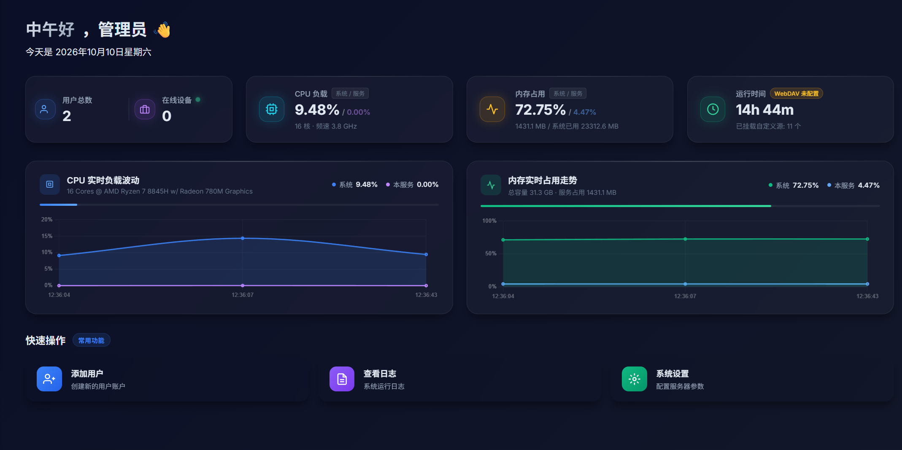
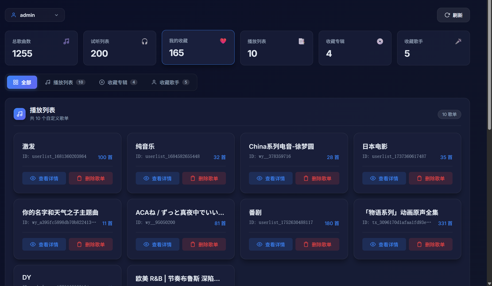
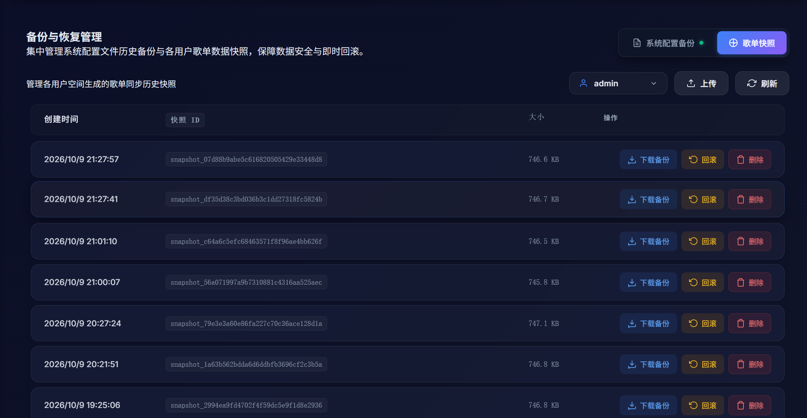
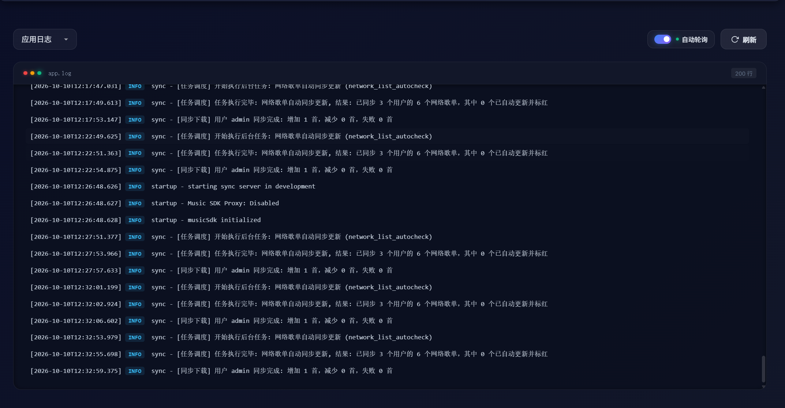

# LX Music Sync Server (Enhanced Edition)

  

    
    
    
    
     
     
    
    
    
    
    
    
  

  

    <a href="https://www.star-history.com/xcq0607/lxserver">
      <picture>
        <source media="(prefers-color-scheme: dark)" srcset="https://api.star-history.com/badge?repo=XCQ0607/lxserver&type=trending&theme=dark" />
        <source media="(prefers-color-scheme: light)" srcset="https://api.star-history.com/badge?repo=XCQ0607/lxserver&type=trending" />
        
      </picture>
    </a>
  

[Documentation](https://xcq0607.github.io/lxserver/) | [WebPlayer](../README_EN.md) | [Changelog](changelog.md)

This project provides both a powerful [WebPlayer](../README_EN.md) and a professional **LX Music Data Sync Service** with a Web visualization dashboard.

## ✨ Sync Server Key Features

### 📊 Dashboard
Intuitive Web interface to monitor service status and connections in real-time.

### 👥 User Management
Easily add/delete users and modify sync keys via the UI to manage multi-device access permissions.

### 🎵 Deep Data Management
- View playlists and song lists online for all users.
- Support for searching and sorting to quickly locate songs.
- Support for batch clearing redundant data or deleting playlists.
  

### 💾 Snapshot Management
- **Auto Backup**: Server automatically generates historical data snapshots.
- **Local Download**: Snapshots can be downloaded as `lx_backup.json` for direct import into LX Music clients.
- **One-click Rollback**: Roll back data to a specific snapshot point to prevent data loss.
  

### 📂 File & System Logs
Built-in lightweight file management system for viewing, downloading, and searching system logs online.

### ☁️ WebDAV Real-time Cloud Sync
- Supports Nutstore, Nextcloud, Alist, and other standard WebDAV drives.
- Supports scheduled full data backup to the cloud.
- Supports one-click restoration from cloud after server reset.
  

---

## 📖 Dashboard & Connection Guide

1. **Access Dashboard**: Visit `http://<server-ip>:9527/admin` (Default dashboard path is `/admin`, default admin password: `123456`).
2. **Initial Setup**: Change your default password in "System Config" immediately after first login.
3. **Add User & Client Connection**: Create sync accounts in the "User Management" page.
   - **User Path Mode (Default & Recommended)**: Client sync URL is `http://<server-ip>:9527/<username>`, password is the user's password. Multiple users can share identical passwords.
   - **Root Path Mode (Requires enabling in System Config)**: Client sync URL is `http://<server-ip>:9527`, password is the user's password. All user passwords must be strictly unique.
4. **Subsonic Client Connection**: Use third-party Subsonic clients (e.g. Yinliu, Feishin) to connect to `http://<server-ip>:9527/rest` with user credentials created in the dashboard.
5. **Backup Strategy**: It's highly recommended to configure cloud backup in "WebDAV Sync" for data safety.

> 💡 For more technical details (Docker deployment, Nginx config, variables, etc.), please return to the **[Project Homepage (README_EN.md)](../README_EN.md)**.

---

## 📈 Star History

<a href="https://www.star-history.com/?repos=xcq0607%2Flxserver&type=timeline&logscale=&releases=&legend=bottom-right">
 <picture>
   <source media="(prefers-color-scheme: dark)" srcset="https://api.star-history.com/chart?repos=xcq0607/lxserver&type=timeline&theme=dark&logscale&legend=bottom-right" />
   <source media="(prefers-color-scheme: light)" srcset="https://api.star-history.com/chart?repos=xcq0607/lxserver&type=timeline&logscale&legend=bottom-right" />
   
 </picture>
</a>
